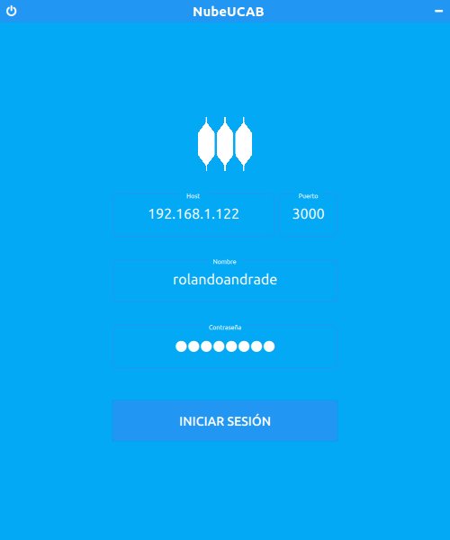
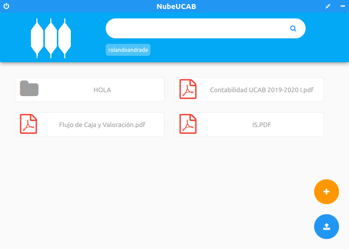
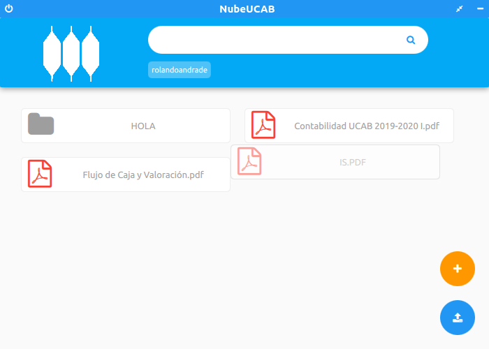
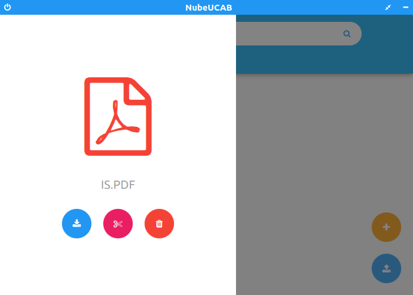
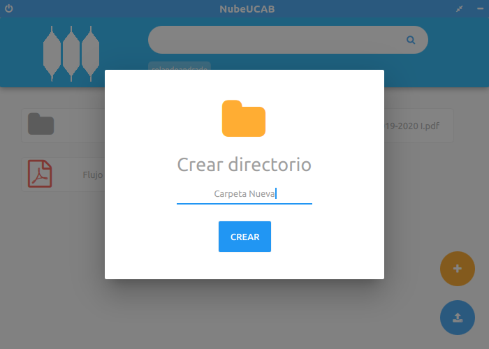
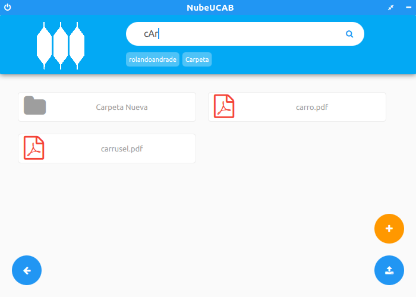

# NubeUCAB

NubeUCAB es una aplicación de escritorio que permite autenticarse, subir y bajar archivos, modificar sus nombres, generar carpetas, eliminar y mover carpetas y archivos, en el servidor FTP NubeUCAB, realizada como proyecto de Redes de Computadores II.

El cliente FTP sin interfaz gráfica se puede encontrar en [NubeUCAB-cliente](https://github.com/RolandoAndrade/NubeUCAB-cliente)

El servidor FTP puede ser tanto:

- [NubeUCAB Manager](https://github.com/RolandoAndrade/NubeUCABManager)

- [NubeUCAB-servidor](https://github.com/RolandoAndrade/NubeUCAB-servidor)

## Capturas de pantalla

